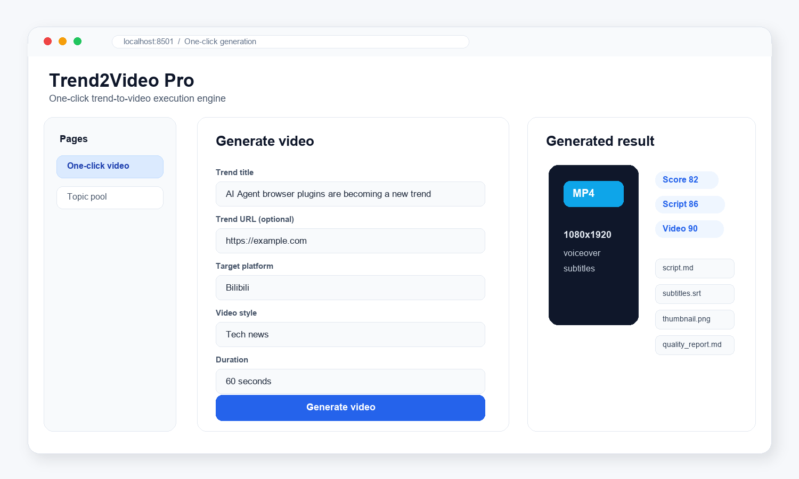
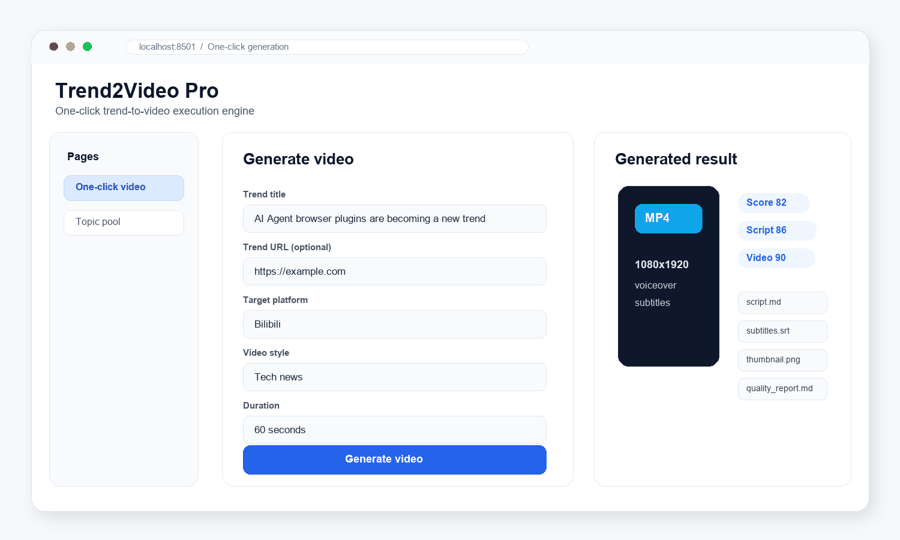
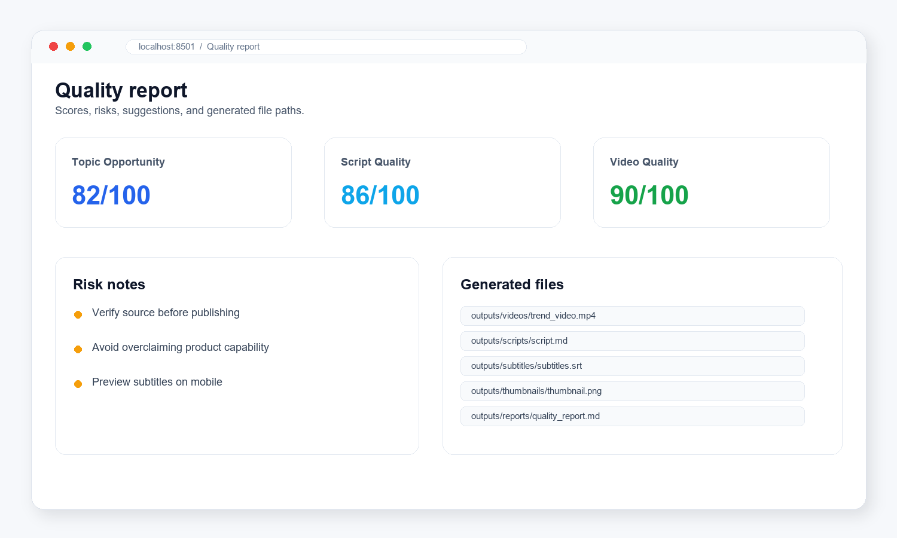
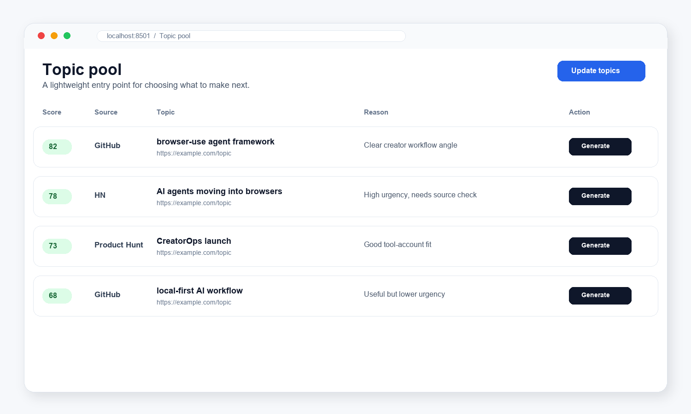
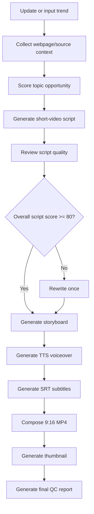
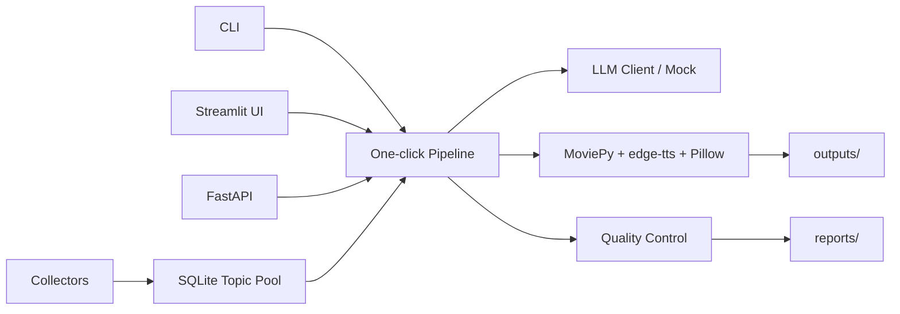

# Trend2Video Pro

<p align="center">
  <strong>One-click trend-to-video execution engine with quality control.</strong>
</p>

<p align="center">
  Discover trends -> score opportunities -> generate scripts -> review quality -> render vertical MP4 -> export a report.
</p>

<p align="center">
  <a href="#quick-start">Quick Start</a> |
  <a href="#what-it-builds">What It Builds</a> |
  <a href="#quality-control">Quality Control</a> |
  <a href="#roadmap">Roadmap</a>
</p>

<p align="center">
  
  
  
  
  
</p>

<p align="center">
  
</p>

## 中文简介

Trend2Video Pro 不是热点分析 Dashboard，也不是单纯的 AI 文案工具。它是一个“一键把热点变成可发布短视频”的自动执行系统。

它把热点发现、内容机会评分、脚本生成、脚本质检、分镜、配音、字幕、封面、竖屏 MP4 和质量控制报告串成一条本地可运行的生产流水线。

## Demo

<p align="center">
  
</p>

Recommended demo command:

```bash
python main.py generate --title "AI Agent 浏览器插件正在变成新趋势" --platform "B站" --style "科技资讯" --duration 60
```

## Why It Is Different

| Common AI video generator | Trend2Video Pro |
| --- | --- |
| User enters a topic | Finds or accepts trends |
| Generates a video directly | Scores whether the topic is worth making |
| Usually lacks content QC | Reviews script and video quality |
| Output is often a black box | Exports script, subtitles, thumbnail, MP4, and report |
| Focuses on generation | Focuses on execution and publish readiness |

The core idea:

```text
发现热点 -> 评分判断 -> 生成脚本 -> 质量检查 -> 生成视频 -> 输出报告
```

## Real Use Cases

- AI 工具号：快速把新工具、新模型、新插件做成短视频。
- 科技资讯号：把 GitHub Trending、HN、产品发布转成解释型内容。
- 小红书知识号：把复杂趋势拆成可收藏、可理解的干货。
- B站科普号：输出脚本、分镜和竖屏视频草稿。
- YouTube Shorts 创作者：快速生产英文或中文短视频素材包。

## What It Builds

One generation creates a local production bundle:

<p align="center">
  
</p>

```text
outputs/
├── videos/trend_video.mp4
├── scripts/script.md
├── scripts/script.json
├── subtitles/subtitles.srt
├── subtitles/subtitles.json
├── thumbnails/thumbnail.png
└── reports/quality_report.md
```

Example outputs:

- `outputs/videos/trend_video.mp4`
- `outputs/scripts/script.md`
- `outputs/subtitles/subtitles.srt`
- `outputs/thumbnails/thumbnail.png`
- `outputs/reports/quality_report.md`

## Core Features

- Trend pool from GitHub Trending, Hacker News, and Product Hunt mock/API-ready collectors.
- Explainable opportunity scoring with trend, competition, monetization, audience fit, and urgency.
- Mock LLM fallback when no API key is configured.
- Short-video script generation with hook, background, 3 key points, user benefit, and CTA.
- Script review and one automatic rewrite pass when quality is low.
- Storyboard generation for every voiceover segment.
- edge-tts voiceover with silent fallback when TTS fails.
- SRT subtitle generation with short Chinese subtitle chunks.
- MoviePy vertical MP4 generation at 1080x1920.
- Thumbnail PNG generation with a clean tech style.
- Markdown and JSON quality control reports.
- SQLite storage for topics, snapshots, and generation tasks.

## Pipeline

<p align="center">
  
</p>



## Architecture



## Quick Start

```bash
git clone https://github.com/2417467487-hub/Trend2Video-Pro.git
cd Trend2Video-Pro
python -m venv .venv
```

Windows:

```bash
.venv\Scripts\activate
```

macOS/Linux:

```bash
source .venv/bin/activate
```

Install dependencies:

```bash
pip install -r requirements.txt
playwright install chromium
copy .env.example .env
```

On macOS/Linux, use:

```bash
cp .env.example .env
```

No API key is required for the first demo. Keep `LLM_PROVIDER=mock`.

## CLI

Generate a video from a title/link:

```bash
python main.py generate --title "OpenAI发布新的AI Agent工具" --url "https://example.com" --platform "B站" --style "科技资讯" --duration 60
```

Update topics:

```bash
python main.py update-topics
```

List topics:

```bash
python main.py list-topics
```

Generate from a stored topic:

```bash
python main.py generate-from-topic --topic-id 1 --platform "小红书" --style "科技资讯" --duration 60
```

## Streamlit App

```bash
streamlit run app.py
```

The app has two pages:

- One-click generation: enter title/link, choose platform/style/duration, generate assets.
- Topic pool: update today's topics, inspect top opportunities, generate from a selected topic.

## FastAPI

```bash
uvicorn main:app --reload
```

```bash
curl -X POST http://127.0.0.1:8000/generate ^
  -H "Content-Type: application/json" ^
  -d "{\"title\":\"AI Agent 浏览器插件正在变成新趋势\",\"platform\":\"B站\",\"duration\":60,\"style\":\"科技资讯\"}"
```

## Configuration

```env
OPENAI_API_KEY=
DEEPSEEK_API_KEY=
QWEN_API_KEY=
LLM_PROVIDER=mock
LLM_MODEL=mock-trend2video
DEFAULT_TTS_VOICE=zh-CN-XiaoxiaoNeural
OUTPUT_DIR=outputs
DATABASE_URL=sqlite:///data/trend2video.db
```

## Quality Control

Quality control is implemented in code, not just described in the README.

| Module | Function | Purpose |
| --- | --- | --- |
| `src/scoring/opportunity_scorer.py` | `score_topic()` | Scores whether a topic is worth making. |
| `src/quality/script_reviewer.py` | `review_script()` | Scores hook, clarity, density, factual risk, and platform fit. |
| `src/generation/storyboard_generator.py` | `generate_storyboard()` | Converts script lines into visual scenes. |
| `src/media/tts_generator.py` | `generate_tts()` | Generates voiceover with edge-tts and fallback audio. |
| `src/media/subtitle_generator.py` | `generate_srt()` | Generates SRT subtitles and keyword metadata. |
| `src/media/video_editor.py` | `compose_video()` | Builds the vertical MP4 with MoviePy. |
| `src/media/thumbnail_generator.py` | `generate_thumbnail()` | Creates the cover image. |
| `src/quality/video_quality_checker.py` | `check_video_quality()` | Checks duration, resolution intent, subtitle, audio, and hook signals. |
| `src/quality/final_report.py` | `generate_final_report()` | Writes the final QC report. |

Topic opportunity formula:

```text
final_score =
0.30 * trend_score
+ 0.20 * audience_fit_score
+ 0.20 * monetization_score
+ 0.20 * urgency_score
- 0.10 * competition_score
```

The report always includes:

```text
Video Quality Score: xx/100
```

## Database

SQLite stores:

- `topics`
- `topic_snapshots`
- `generation_tasks`

Duplicate topic URLs are not inserted twice. Repeated URLs update topic fields and add snapshots.

## Demo Data

Sample files live in `data/examples/`:

- `sample_topic.json`
- `sample_script.json`
- `sample_storyboard.json`
- `sample_quality_report.md`

## Tests

```bash
pytest
```

The test suite does not require real API keys or real network access.

## Contributing

This repository is public. Anyone can fork it and open a Pull Request.

If you want someone to edit the main repository directly, invite them in GitHub:

```text
Settings -> Collaborators -> Add people
```

See [CONTRIBUTING.md](CONTRIBUTING.md).

## Roadmap

See [docs/ROADMAP.md](docs/ROADMAP.md).

## License

MIT. See [LICENSE](LICENSE).
