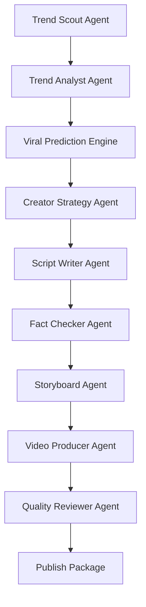

# Trend2Video Pro

<p align="center">
  <strong>Trend Intelligence + Content Execution System</strong>
</p>

<p align="center">
  Discover trends, predict viral potential, analyze creator fit, and export publish-ready short-video packages.
</p>

<p align="center">
  <a href="#quick-start">Quick Start</a> |
  <a href="#pipeline">Pipeline</a> |
  <a href="#creator-intelligence">Creator Intelligence</a> |
  <a href="#publish-package">Publish Package</a> |
  <a href="#chrome-extension">Chrome Extension</a>
</p>

<p align="center">
  
  
  
  
  
  
</p>

<p align="center">
  
</p>

## Why Trend2Video Pro

Trend2Video Pro is not a dashboard. It is not a simple AI video generator.

It is an execution-first system for creators:

```text
trend discovery -> viral prediction -> creator fit analysis -> content strategy
-> script -> fact check -> storyboard -> video -> publish package -> quality evaluation
```

The final product is not only a script or a video file. The final product is a structured publish package with MP4, thumbnail, title, description, hashtags, subtitles, metadata, and quality report.

Demo mode works without API keys. If an LLM or network collector fails, the system falls back to mock data so the pipeline remains runnable.

## Screenshots

| One-click generate | Trend pool |
| --- | --- |
|  |  |

| Quality report | Demo flow |
| --- | --- |
|  |  |

## What Makes It Different

| Typical AI video tool | Trend2Video Pro |
| --- | --- |
| Starts from a prompt | Starts from trend intelligence |
| Generates one asset | Exports a complete publish package |
| Treats every creator the same | Uses creator profile and memory |
| Has weak quality control | Scores topic, script, facts, video, and readiness |
| Mostly a UI wrapper | Provides CLI, API, agent pipeline, SQLite history, and extension |

## Quick Start

```bash
git clone https://github.com/2417467487-hub/Trend2Video-Pro.git
cd Trend2Video-Pro
python -m venv .venv
```

Windows:

```bash
.venv\Scripts\activate
```

macOS/Linux:

```bash
source .venv/bin/activate
```

Install:

```bash
pip install -r requirements.txt
playwright install chromium
copy .env.example .env
```

macOS/Linux:

```bash
cp .env.example .env
```

## CLI

```bash
python main.py generate --title "AI Agent Trend" --platform "Bilibili" --style "Tech News" --duration 60
python main.py update-topics
python main.py list-topics
python main.py generate-from-topic --topic-id 1 --platform "Xiaohongshu" --style "Tech News" --duration 60
```

## Streamlit UI

```bash
streamlit run app.py
```

The UI stays intentionally simple:

- One-click generate
- Trend list
- Creator profile editor
- Generated publish packages viewer

No analytics dashboard. The interface exists to execute the pipeline.

## API

```bash
uvicorn api:app --reload
```

Endpoints:

- `GET /health`
- `POST /api/score`
- `POST /api/generate`
- `POST /api/update-topics`
- `GET /api/topics`
- `POST /api/generate-from-topic?topic_id=1`

Score-only example:

```bash
curl -X POST http://127.0.0.1:8000/api/score ^
  -H "Content-Type: application/json" ^
  -d "{\"title\":\"AI Agent Trend\",\"platform\":\"Bilibili\",\"style\":\"Tech News\"}"
```

Returns:

```json
{
  "viral_probability": 0.67,
  "predicted_views": "10k-50k",
  "competition_level": "medium",
  "recommendation": "generate_now",
  "explanation": "Rule-based MVP using trend, urgency, creator fit, monetization, competition, hook strength, and platform fit."
}
```

## Pipeline



Main orchestrator:

```python
from src.agents.orchestrator import run_trend_to_video

result = run_trend_to_video(
    topic={"title": "AI Agent Trend", "url": ""},
    creator_profile=None,
    platform="Bilibili",
    style="Tech News",
    duration=60,
)
```

## Creator Intelligence

Creator profile and memory live in:

```text
src/creator/creator_profile.json
src/creator/creator_memory.py
src/creator/fit_scorer.py
```

The system stores:

- creator niche
- target platforms
- tone and audience
- past viral content
- historical generation records

Outputs:

- `creator_fit_score`
- matched creator keywords
- recommended content angle
- explanation

## Viral Prediction

The MVP predictor is transparent and rule-based, with an optional path for future sklearn regression.

Features:

- trend score
- competition score
- urgency score
- creator fit score
- hook strength estimate
- platform short-video fit

Output:

- `viral_probability`
- `predicted_view_range`
- `confidence_level`
- `explanation`

## Publish Package

After generation, Trend2Video Pro exports:

```text
outputs/publish_packages/{id}/
  video.mp4
  title.txt
  description.txt
  hashtags.txt
  thumbnail.png
  subtitles.srt
  quality_report.md
  metadata.json
```

This folder is the handoff unit for manual review and publishing.

## Quality Control

Quality checks are implemented in code:

- `review_script()` checks hook, clarity, density, factual risk, and platform fit.
- `check_factual_risk()` flags absolute claims.
- `check_video_quality()` outputs hook score, clarity score, density score, factual risk score, and overall score.
- `generate_final_report()` writes Markdown and JSON reports.

Opportunity formula:

```text
final_score =
0.30 * trend_score
+ 0.20 * audience_fit_score
+ 0.20 * monetization_score
+ 0.20 * urgency_score
- 0.10 * competition_score
```

## Data Layer

SQLite tables:

- `trends`
- `creator_memory`
- `viral_predictions`
- `publish_packages`
- `generation_tasks`
- `topic_snapshots`

URLs are deduplicated in the trend table. Trend history is preserved for future model training.

## Chrome Extension

A lightweight extension is included in `extension/`.

It detects GitHub, Product Hunt, and Hacker News pages, adds a `Generate Video` button, and sends the page title and URL to:

```text
POST http://127.0.0.1:8000/api/generate
```

Load it from `chrome://extensions` with Developer mode -> Load unpacked -> select `extension/`.

## Benchmark

```bash
python evaluation/run_benchmark.py
```

Metrics:

- hook score
- viral accuracy proxy
- script quality
- publish readiness score

Output:

```text
evaluation/benchmark_summary.md
```

## Tests

```bash
pytest
```

Tests run in mock mode and do not require API keys.

## Roadmap

- Citation-aware fact checking.
- Better topic collectors and source extraction.
- Creator profile presets.
- Real performance feedback loop from published videos.
- More visual templates and subtitle styles.
- Optional publishing integrations after local package export is stable.
- Replace rule-based viral prediction once enough history exists.

See [docs/ROADMAP.md](docs/ROADMAP.md).

## Contributing

This repository is public. Fork it, improve an agent, add a template, or open a Pull Request.

See [CONTRIBUTING.md](CONTRIBUTING.md).

## License

MIT. See [LICENSE](LICENSE).
