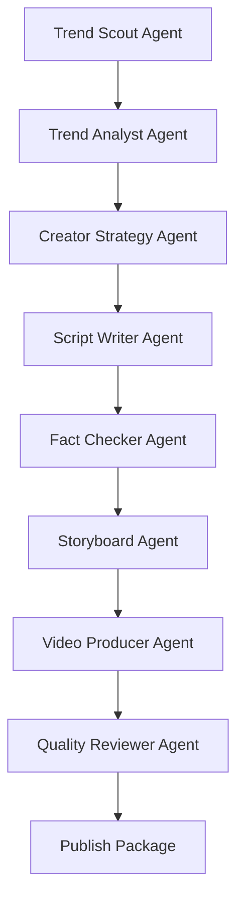

# Trend2Video Pro

<p align="center">
  <strong>The Open-Source Trend-to-Video Agent Framework for Content Creators</strong>
</p>

<p align="center">
  Trend discovery -> opportunity scoring -> creator fit -> script -> fact check -> storyboard -> video -> quality review -> publish package.
</p>

<p align="center">
  <a href="#quick-start">Quick Start</a> |
  <a href="#multi-agent-pipeline">Multi-Agent Pipeline</a> |
  <a href="#creator-memory">Creator Memory</a> |
  <a href="#publish-package-output">Publish Package</a> |
  <a href="#roadmap">Roadmap</a>
</p>

<p align="center">
  
  
  
  
  
  
</p>

<p align="center">
  
</p>

## Why Trend2Video Pro

Trend2Video Pro is not a dashboard and not a simple AI copywriting tool. It is an execution-first framework that turns a trend into a creator-ready short-video publishing package.

Most AI video tools start at "write me a video." Trend2Video starts earlier:

1. What is trending?
2. Is the topic worth making?
3. Does it fit this creator?
4. Can we generate a script, storyboard, voiceover, subtitles, thumbnail, MP4, and quality report?
5. Can the final bundle be reviewed and published manually?

No API key is required for demo mode. The project uses mock LLM responses and mock fallback collectors when network/API calls fail.

## Screenshots

| One-click generation | Topic pool |
| --- | --- |
|  |  |

| Quality report | Product flow |
| --- | --- |
|  |  |

## What Makes It Different

| Common AI video generator | Trend2Video Pro |
| --- | --- |
| User enters a topic | Discovers or accepts trends |
| Generates a video directly | Scores opportunity and creator fit first |
| Usually lacks memory | Uses creator profile and content history |
| Usually lacks QC | Reviews script, video, risks, and publish readiness |
| Output is often a black box | Exports a structured publish package |
| Focuses on generation | Focuses on trend-to-video execution |

## Quick Start

```bash
git clone https://github.com/2417467487-hub/Trend2Video-Pro.git
cd Trend2Video-Pro
python -m venv .venv
```

Windows:

```bash
.venv\Scripts\activate
```

macOS/Linux:

```bash
source .venv/bin/activate
```

Install dependencies:

```bash
pip install -r requirements.txt
playwright install chromium
copy .env.example .env
```

On macOS/Linux:

```bash
cp .env.example .env
```

## CLI

```bash
python main.py generate --title "AI Agent Browser Tool Trend" --platform "Bilibili" --style "Tech News" --duration 60
python main.py update-topics
python main.py list-topics
python main.py generate-from-topic --topic-id 1 --platform "Xiaohongshu" --style "Tech News" --duration 60
```

## Streamlit

```bash
streamlit run app.py
```

The UI is intentionally simple:

- One-Click Generate
- Trend Pool
- Creator Profile
- Generated Packages

It is not a complex analytics dashboard. The topic pool is only an entry point into execution.

## API

```bash
uvicorn api:app --reload
```

Endpoints:

- `GET /health`
- `POST /api/generate`
- `POST /api/update-topics`
- `GET /api/topics`
- `POST /api/generate-from-topic?topic_id=1`

## Multi-Agent Pipeline

Trend2Video Pro now exposes a lightweight agent layer in `src/agents/`.



Main orchestrator:

```python
from src.agents.orchestrator import run_trend_to_video

result = run_trend_to_video(
    topic={"title": "AI Agent Browser Tool Trend", "url": ""},
    creator_profile=None,
    platform="Bilibili",
    style="Tech News",
    duration=60,
)
```

## Creator Memory

Creator memory lives in:

```text
creator_profiles/default_creator.json
src/creator/
```

It stores:

- creator niche
- target platforms
- tone
- audience
- keyword profile
- past successful content

The framework calculates a creator-topic fit score before generation, so the same trend can be evaluated differently for different creators.

## Viral Prediction

The MVP viral predictor is rule-based and transparent. It outputs:

```json
{
  "viral_probability": 0.64,
  "predicted_view_range": "10k-50k",
  "confidence_level": "medium",
  "explanation": "Rule-based MVP using trend, urgency, creator fit, monetization, competition, and platform fit."
}
```

Files:

```text
src/prediction/feature_builder.py
src/prediction/viral_predictor.py
```

## Publish Package Output

After generation, a creator-ready package is exported:

```text
outputs/publish_packages/{timestamp}_{title}/
├── video.mp4
├── thumbnail.png
├── title.txt
├── description.txt
├── hashtags.txt
├── subtitles.srt
├── quality_report.md
└── metadata.json
```

This is the final handoff unit for manual review and publishing.

## Core Modules

| Area | Path |
| --- | --- |
| Agents | `src/agents/` |
| Creator memory | `src/creator/` |
| Viral prediction | `src/prediction/` |
| Publish package | `src/publishing/` |
| Collectors | `src/collectors/` |
| Scoring | `src/scoring/` |
| Generation | `src/generation/` |
| Media | `src/media/` |
| Quality | `src/quality/` |
| API | `api.py` |
| CLI | `main.py` |
| UI | `app.py` |

## Quality Control

Quality control is implemented in code:

- `review_script()` checks hook, clarity, density, factual risk, and platform fit.
- `check_factual_risk()` flags absolute claims.
- `check_video_quality()` checks output existence, duration intent, subtitle/audio signals, and hook signal.
- `generate_final_report()` writes Markdown and JSON reports.
- `quality_reviewer_agent.py` summarizes publish readiness.

Opportunity formula:

```text
final_score =
0.30 * trend_score
+ 0.20 * audience_fit_score
+ 0.20 * monetization_score
+ 0.20 * urgency_score
- 0.10 * competition_score
```

## Benchmark

Run a mock-mode benchmark:

```bash
python evaluation/run_benchmark.py
```

Output:

```text
evaluation/benchmark_summary.md
```

## Tests

```bash
pytest
```

Tests do not require real API keys or real network access.

## Roadmap

- Stronger source extraction and citation-aware fact checks.
- More creator profile presets.
- Real performance feedback loop from published videos.
- More visual templates and subtitle styles.
- Optional publish integrations after local export is stable.
- Replace rule-based viral prediction with a trained baseline once enough data exists.

See [docs/ROADMAP.md](docs/ROADMAP.md).

## Contributing

This repository is public. Fork it and open a Pull Request.

See [CONTRIBUTING.md](CONTRIBUTING.md).

## License

MIT. See [LICENSE](LICENSE).
