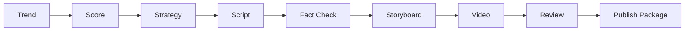

# Trend2Video Pro

<p align="center">
  <strong>Turn trends into viral-ready short video packages in one click.</strong>
</p>

<p align="center">
  Trend Intelligence + Content Execution System for creators who want publish-ready assets, not another dashboard.
</p>

<p align="center">
  <a href="#quick-start">Quick Start</a> ·
  <a href="#what-it-builds">What It Builds</a> ·
  <a href="#pipeline-architecture">Pipeline</a> ·
  <a href="#output-example">Output Example</a> ·
  <a href="#screenshots">Screenshots</a>
</p>

<p align="center">
  
  
  
  
  
  
</p>

<p align="center">
  
</p>

## The 5-Second Pitch

Paste a trend title or URL. Choose a platform. Click one button.

Trend2Video Pro runs a creator-focused execution pipeline and exports a complete short-video package:

```text
Trend / URL -> Viral Video Package
```

This is not a dashboard. This is not a simple script generator. It is an execution console for content creators.

## What It Builds

| Input | Output |
| --- | --- |
| Trend title | MP4 vertical video |
| URL from GitHub, Product Hunt, Hacker News, or news pages | Video title |
| Target platform | Thumbnail |
| Creator style | Description |
| Duration | Hashtags |
| Creator profile | Subtitles |
| Quality rules | Quality report |

The end result is a folder you can review and publish from.

## Execution Console

The Streamlit UI is designed around one job: create the package.

```text
1. Trend Input Panel
2. Agent Execution Progress
3. Output Package
```

No analytics dashboard. No raw technical tables. No log wall.

The UI shows:

- video preview player
- viral score
- final title
- thumbnail preview
- hashtags
- description
- subtitles
- quality report summary
- download buttons

## Pipeline Architecture



Under the hood:

```text
trend discovery
-> viral prediction
-> creator fit analysis
-> content strategy
-> script writing
-> fact checking
-> storyboard generation
-> video generation
-> quality review
-> publish package export
```

## Why It Is Different

| Category | AI video generators | Script generators | Trend2Video Pro |
| --- | --- | --- | --- |
| Starts from trends | Sometimes | No | Yes |
| Viral potential scoring | Rare | No | Yes |
| Creator fit system | No | No | Yes |
| Script generation | Yes | Yes | Yes |
| Fact/risk checks | Limited | Limited | Yes |
| Storyboard | Sometimes | No | Yes |
| MP4 export | Yes | No | Yes |
| Publish package | Rare | No | Yes |
| Local runnable demo | Often no | Usually yes | Yes |

Trend2Video Pro focuses on the whole creator workflow, not a single asset.

## Output Example

```text
outputs/publish_packages/20260613_222144_ai-agent-trend/
  video.mp4
  title.txt
  description.txt
  hashtags.txt
  thumbnail.png
  subtitles.srt
  quality_report.md
  metadata.json
```

The package contains everything a creator needs for manual review and posting.

## Screenshots

| Execution console | Topic pool |
| --- | --- |
|  |  |

| Quality report | Demo workflow |
| --- | --- |
|  |  |

## Quick Start

```bash
git clone https://github.com/2417467487-hub/Trend2Video-Pro.git
cd Trend2Video-Pro
python -m venv .venv
```

Windows:

```bash
.venv\Scripts\activate
```

macOS/Linux:

```bash
source .venv/bin/activate
```

Install dependencies:

```bash
pip install -r requirements.txt
playwright install chromium
copy .env.example .env
```

macOS/Linux:

```bash
cp .env.example .env
```

## Run The Product UI

```bash
streamlit run app.py
```

## CLI

```bash
python main.py generate --title "AI Agent Trend" --platform "Bilibili" --style "Tech News" --duration 60
python main.py update-topics
python main.py list-topics
python main.py generate-from-topic --topic-id 1 --platform "Xiaohongshu" --style "Tech News" --duration 60
```

## API

```bash
uvicorn api:app --reload
```

Endpoints:

- `GET /health`
- `POST /api/score`
- `POST /api/generate`
- `POST /api/update-topics`
- `GET /api/topics`
- `POST /api/generate-from-topic?topic_id=1`

## Chrome Extension

The lightweight extension in `extension/` adds a `Generate Video` button on GitHub, Product Hunt, and Hacker News pages.

Run the local API first:

```bash
uvicorn api:app --reload
```

Then load `extension/` from `chrome://extensions` with Developer mode enabled.

## Core Modules

```text
src/agents/       multi-agent orchestration
src/creator/      creator profile, memory, and fit scoring
src/prediction/   viral prediction engine
src/generation/   script, title, storyboard, and copy generation
src/media/        TTS, subtitles, thumbnail, and MP4 rendering
src/quality/      script, fact, video, and final quality checks
src/publishing/   publish package builder
src/database/     SQLite trend history and package records
```

## Quality Control

Trend2Video Pro includes quality control in code:

- script hook score
- clarity score
- information density score
- factual risk score
- video quality score
- final report

Low-scoring topics can still be generated, but the report will explain why they are not priority production candidates.

## Benchmark

```bash
python evaluation/run_benchmark.py
```

Benchmark output includes:

- hook score
- viral accuracy proxy
- script quality
- publish readiness score

## Tests

```bash
pytest
```

The test suite runs in mock mode and does not require API keys.

## Roadmap

- Better source extraction from trend pages
- Citation-aware fact checking
- More creator profile presets
- Stronger thumbnail and subtitle templates
- Trained viral prediction once enough history exists
- Optional publishing integrations after local package export is stable

## Contributing

This is a public open-source project. Fork it, improve an agent, add a template, or open a pull request.

See [CONTRIBUTING.md](CONTRIBUTING.md).

## License

MIT. See [LICENSE](LICENSE).
