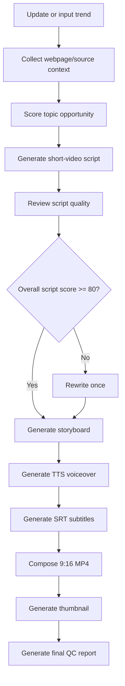
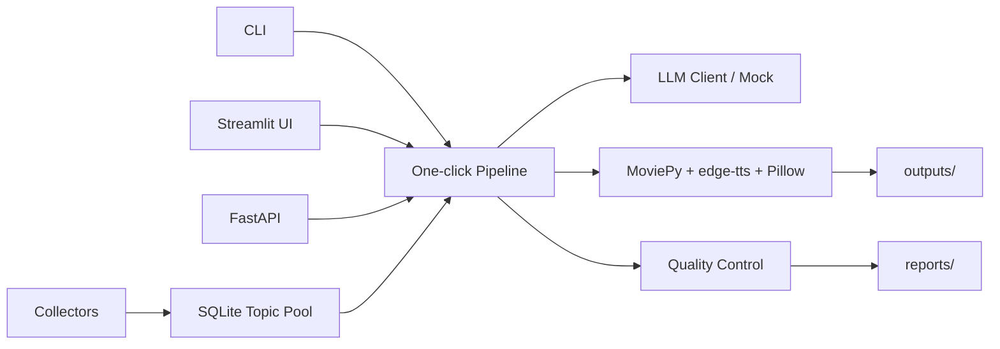

# Trend2Video Pro

<p align="center">
  <strong>One-click trend-to-video execution engine with quality control.</strong>
</p>

<p align="center">
  Discover trends -> score opportunities -> generate scripts -> review quality -> render vertical MP4 -> export a report.
</p>

<p align="center">
  <a href="#quick-start">Quick Start</a> |
  <a href="#screenshots">Screenshots</a> |
  <a href="#what-it-builds">What It Builds</a> |
  <a href="#quality-control">Quality Control</a> |
  <a href="#roadmap">Roadmap</a>
</p>

<p align="center">
  
  
  
  
  
  
</p>

<p align="center">
  
</p>

## 中文简介

Trend2Video Pro 不是热点分析 Dashboard，也不是单纯的 AI 文案工具。它是一个“一键把热点变成可发布短视频”的自动执行系统。

它把热点发现、内容机会评分、脚本生成、脚本质检、分镜、配音、字幕、封面、竖屏 MP4 和质量控制报告串成一条本地可运行的生产流水线。第一版不做自动发布，专注于本地生成可发布视频资产。

## At A Glance

| Area | What it does |
| --- | --- |
| Trend entry | Accepts a manual trend title/link or updates a lightweight topic pool. |
| Opportunity scoring | Scores trend heat, competition, monetization, audience fit, and urgency with explainable rules. |
| Content generation | Produces spoken script, storyboard, voiceover, subtitles, thumbnail, and MP4. |
| Quality control | Reviews script quality, checks video output, and exports a QC report. |
| Local-first demo | Runs with mock LLM responses when no API key is configured. |

## Screenshots

| One-click generation | Topic pool |
| --- | --- |
|  |  |

| Quality report | Product flow |
| --- | --- |
|  |  |

## Why It Is Different

| Common AI video generator | Trend2Video Pro |
| --- | --- |
| User enters a topic | Finds or accepts trends |
| Generates a video directly | Scores whether the topic is worth making |
| Usually lacks content QC | Reviews script and video quality |
| Output is often a black box | Exports script, subtitles, thumbnail, MP4, and report |
| Focuses on generation | Focuses on execution and publish readiness |

Core idea:

```text
发现热点 -> 评分判断 -> 生成脚本 -> 质量检查 -> 生成视频 -> 输出报告
```

## Real Use Cases

| Use case | Example workflow |
| --- | --- |
| AI 工具号 | Turn a new AI tool, model, or browser plugin into a short explainer. |
| 科技资讯号 | Convert GitHub Trending, Hacker News, or product launches into video briefs. |
| 小红书知识号 | Turn complex tech trends into concise, saveable knowledge cards. |
| B站科普号 | Generate script, storyboard, subtitles, and a vertical video draft. |
| YouTube Shorts 创作者 | Produce bilingual short-video asset packages for fast iteration. |

## What It Builds

One generation creates a local production bundle:

```text
outputs/
├── videos/trend_video.mp4
├── scripts/script.md
├── scripts/script.json
├── subtitles/subtitles.srt
├── subtitles/subtitles.json
├── thumbnails/thumbnail.png
└── reports/quality_report.md
```

Example generated report:

```text
Topic Opportunity Score: 82/100
Script Quality Score: 86/100
Video Quality Score: 90/100

Risks:
- Verify source before publishing.
- Avoid overclaiming product capability.

Generated files:
- outputs/videos/trend_video.mp4
- outputs/scripts/script.md
- outputs/subtitles/subtitles.srt
- outputs/thumbnails/thumbnail.png
- outputs/reports/quality_report.md
```

## Core Features

| Feature | Status | Notes |
| --- | --- | --- |
| Manual trend input | Ready | Title + optional URL. |
| Topic pool | Ready | GitHub Trending, Hacker News, Product Hunt mock/API-ready collectors. |
| Explainable scoring | Ready | Formula-based scoring, no random black-box score. |
| LLM wrapper | Ready | OpenAI / DeepSeek / Qwen / mock fallback. |
| Script generation | Ready | Hook, background, 3 points, user benefit, CTA. |
| Script review | Ready | Auto rewrite once when score is low. |
| Storyboard | Ready | One scene per voiceover segment. |
| TTS | Ready | edge-tts with silent fallback. |
| Subtitles | Ready | SRT + keyword JSON. |
| Video composition | Ready | MoviePy vertical MP4. |
| Thumbnail | Ready | Pillow-generated PNG. |
| Quality report | Ready | Markdown + JSON. |

## Pipeline



## Architecture



## Tech Stack

| Layer | Tools |
| --- | --- |
| UI | Streamlit |
| API | FastAPI |
| CLI | argparse |
| Video | MoviePy, Pillow |
| Voice | edge-tts |
| Web capture | Playwright, BeautifulSoup |
| Data | SQLite, SQLAlchemy |
| LLM | OpenAI / DeepSeek / Qwen / mock |
| Tests | pytest |

## Quick Start

```bash
git clone https://github.com/2417467487-hub/Trend2Video-Pro.git
cd Trend2Video-Pro
python -m venv .venv
```

Windows:

```bash
.venv\Scripts\activate
```

macOS/Linux:

```bash
source .venv/bin/activate
```

Install dependencies:

```bash
pip install -r requirements.txt
playwright install chromium
copy .env.example .env
```

On macOS/Linux:

```bash
cp .env.example .env
```

No API key is required for the first demo. Keep `LLM_PROVIDER=mock`.

## Run It

Generate a video:

```bash
python main.py generate --title "AI Agent 浏览器插件正在变成新趋势" --platform "B站" --style "科技资讯" --duration 60
```

Update and list topics:

```bash
python main.py update-topics
python main.py list-topics
```

Generate from a stored topic:

```bash
python main.py generate-from-topic --topic-id 1 --platform "小红书" --style "科技资讯" --duration 60
```

Run Streamlit:

```bash
streamlit run app.py
```

Run FastAPI:

```bash
uvicorn main:app --reload
```

## Configuration

```env
OPENAI_API_KEY=
DEEPSEEK_API_KEY=
QWEN_API_KEY=
LLM_PROVIDER=mock
LLM_MODEL=mock-trend2video
DEFAULT_TTS_VOICE=zh-CN-XiaoxiaoNeural
OUTPUT_DIR=outputs
DATABASE_URL=sqlite:///data/trend2video.db
```

## Quality Control

Quality control is implemented in code, not just described in the README.

| Module | Function | Purpose |
| --- | --- | --- |
| `src/scoring/opportunity_scorer.py` | `score_topic()` | Scores whether a topic is worth making. |
| `src/quality/script_reviewer.py` | `review_script()` | Scores hook, clarity, density, factual risk, and platform fit. |
| `src/generation/storyboard_generator.py` | `generate_storyboard()` | Converts script lines into visual scenes. |
| `src/media/tts_generator.py` | `generate_tts()` | Generates voiceover with edge-tts and fallback audio. |
| `src/media/subtitle_generator.py` | `generate_srt()` | Generates SRT subtitles and keyword metadata. |
| `src/media/video_editor.py` | `compose_video()` | Builds the vertical MP4 with MoviePy. |
| `src/media/thumbnail_generator.py` | `generate_thumbnail()` | Creates the cover image. |
| `src/quality/video_quality_checker.py` | `check_video_quality()` | Checks duration, resolution intent, subtitle, audio, and hook signals. |
| `src/quality/final_report.py` | `generate_final_report()` | Writes the final QC report. |

Topic opportunity formula:

```text
final_score =
0.30 * trend_score
+ 0.20 * audience_fit_score
+ 0.20 * monetization_score
+ 0.20 * urgency_score
- 0.10 * competition_score
```

The report always includes:

```text
Video Quality Score: xx/100
```

## Repository Map

```text
Trend2Video-Pro/
├── app.py                    # Streamlit UI
├── main.py                   # CLI + FastAPI
├── src/
│   ├── collectors/           # Trend collectors
│   ├── scoring/              # Opportunity scoring
│   ├── generation/           # LLM, script, storyboard
│   ├── media/                # TTS, subtitles, video, thumbnail
│   ├── quality/              # QC checks and report
│   ├── database/             # SQLite models/helpers
│   └── utils/
├── data/examples/            # Demo data
├── docs/                     # Architecture, roadmap, screenshots
├── outputs/                  # Local generated assets
└── tests/                    # pytest suite
```

## Demo Data

Sample files live in `data/examples/`:

- `sample_topic.json`
- `sample_script.json`
- `sample_storyboard.json`
- `sample_quality_report.md`

## Tests

```bash
pytest
```

The test suite does not require real API keys or real network access.

## FAQ

**Does it publish to social platforms automatically?**  
No. The MVP only exports local MP4, script, subtitles, thumbnail, and quality report.

**Can it run without an LLM API key?**  
Yes. It uses deterministic mock responses when `LLM_PROVIDER=mock`.

**Is this a dashboard?**  
No. The topic pool is only an entry point. The core product is the one-click video generation pipeline.

**Why formula-based scoring instead of machine learning?**  
The first version prioritizes explainability and demo reliability.

## Contributing

This repository is public. Anyone can fork it and open a Pull Request.

If you want someone to edit the main repository directly, invite them in GitHub:

```text
Settings -> Collaborators -> Add people
```

See [CONTRIBUTING.md](CONTRIBUTING.md).

## Roadmap

See [docs/ROADMAP.md](docs/ROADMAP.md).

## License

MIT. See [LICENSE](LICENSE).
