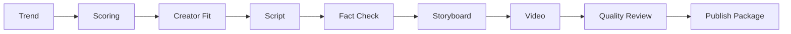

# Trend2Video Pro

<p align="center">
  <strong>Trend-to-Video Agent Framework</strong>
</p>

<p align="center">
  Turn trends into publish-ready short video packages with trend intelligence, creator fit, viral prediction, and quality control.
</p>

<p align="center">
  <a href="#quick-start">Quick Start</a> ·
  <a href="#what-it-builds">What It Builds</a> ·
  <a href="#architecture">Architecture</a> ·
  <a href="#output-example">Output Example</a> ·
  <a href="#why-it-is-different">Why Different</a>
</p>

<p align="center">
  
  
  
  
  
  
</p>

<p align="center">
  
</p>

## The Idea

Trend2Video Pro is a **Trend Intelligence + Content Execution System**.

It is **not a dashboard**.  
It is **not a simple AI video generator**.  
It is an execution-first agent framework that decides what to make, generates the assets, checks quality, and exports a ready-to-review content package.

```text
Input trend -> system decides -> system generates -> publish-ready package
```

## What It Builds

| Input | Output |
| --- | --- |
| Trend title or URL | Vertical MP4 video |
| Target platform | Title |
| Creator style | Thumbnail |
| Duration | Description |
| Creator profile | Hashtags |
| Quality rules | Subtitles |
| Optional page screenshot | Quality report |

The final artifact is a local folder, not only a video file.

## Architecture



Agent layer:

```text
src/agents/
  trend_scout.py
  trend_analyzer.py
  creator_strategy.py
  script_writer.py
  fact_checker.py
  storyboard.py
  video_producer.py
  quality_reviewer.py
  orchestrator.py
```

Main entry point:

```python
from src.agents.orchestrator import run_trend_to_video

result = run_trend_to_video(
    topic={"title": "AI Agent Trend", "url": ""},
    platform="Bilibili",
    style="Tech News",
    duration=60,
)
```

## Output Example

```text
outputs/publish_packages/20260613_222144_ai-agent-trend/
  video.mp4
  title.txt
  description.txt
  hashtags.txt
  thumbnail.png
  subtitles.srt
  quality_report.md
  metadata.json
```

This package is the product output: a creator can review it, edit copy if needed, and publish manually.

## Why It Is Different

| Capability | AI video tools | Script generators | Trend2Video Pro |
| --- | --- | --- | --- |
| Trend discovery | Sometimes | No | Yes |
| Viral prediction | Rare | No | Yes |
| Creator memory | No | No | Yes |
| Creator-topic fit | No | No | Yes |
| Script generation | Yes | Yes | Yes |
| Fact/risk review | Limited | Limited | Yes |
| Storyboard | Sometimes | No | Yes |
| MP4 output | Yes | No | Yes |
| Publish package | Rare | No | Yes |
| Local mock mode | Often no | Usually yes | Yes |

Trend2Video Pro focuses on the full execution loop, not one isolated generation step.

## Execution Console

The Streamlit UI has only three sections:

```text
1. Input: trend/url + platform + style + duration
2. Execute: one-click agent pipeline
3. Output: video preview + score + package downloads
```

No analytics dashboard. No charts. No raw logs. The UI is built for creator execution.

## Screenshots

| Execution console | Output quality |
| --- | --- |
|  |  |

| Trend input | Demo workflow |
| --- | --- |
|  |  |

## Quick Start

```bash
git clone https://github.com/2417467487-hub/Trend2Video-Pro.git
cd Trend2Video-Pro
python -m venv .venv
```

Windows:

```bash
.venv\Scripts\activate
```

macOS/Linux:

```bash
source .venv/bin/activate
```

Install dependencies:

```bash
pip install -r requirements.txt
playwright install chromium
copy .env.example .env
```

macOS/Linux:

```bash
cp .env.example .env
```

Run the product UI:

```bash
streamlit run app.py
```

## CLI

```bash
python main.py generate --title "AI Agent Trend" --platform "Bilibili" --style "Tech News" --duration 60
python main.py update-topics
python main.py list-topics
python main.py generate-from-topic --topic-id 1 --platform "Xiaohongshu" --style "Tech News" --duration 60
```

## API

```bash
uvicorn api:app --reload
```

Endpoints:

- `POST /api/generate`
- `POST /api/score`
- `GET /api/topics`
- `POST /api/update-topics`
- `POST /api/generate-from-topic?topic_id=1`
- `GET /health`

## Creator Intelligence

Creator memory lives in `src/creator/` and stores:

- niche
- tone
- target platforms
- audience
- past content memory
- creator-topic fit signals

It influences scoring and content angle recommendation before generation.

## Viral Prediction MVP

The prediction engine lives in `src/prediction/` and outputs:

- `viral_probability`
- `predicted_views`
- `confidence_level`
- `explanation`

Inputs include trend score, competition, urgency, creator fit, and hook strength. The current baseline is transparent and rule-based, with room for an sklearn model once enough history exists.

## Quality Control

Quality checks are implemented in code:

- 3-second hook signal
- 3 key points
- CTA presence
- hook score
- clarity score
- density score
- factual risk score
- overall score

Scripts below quality threshold are rewritten once before the package is finalized.

## Benchmark

```bash
python evaluation/run_benchmark.py
```

Mock-mode benchmark metrics:

- hook score
- viral accuracy proxy
- script quality
- publish readiness

## Tests

```bash
pytest
```

The test suite runs without API keys.

## Roadmap

- Citation-aware fact checking
- More creator profile presets
- More visual templates and subtitle styles
- Trained viral prediction once enough package history exists
- Optional publishing integrations after local export is stable

## License

MIT. See [LICENSE](LICENSE).
