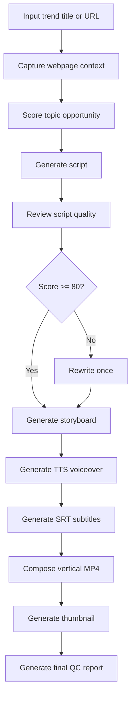
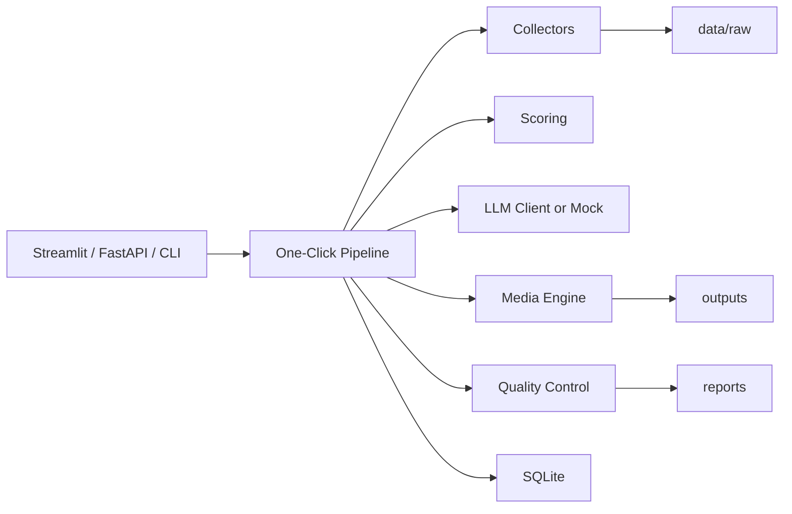

# Trend2Video Pro

<p align="center">
  <strong>From Emerging Trend to Publish-Ready Short Video in One Click</strong>
</p>

<p align="center">
  <a href="#quick-start">Quick Start</a> |
  <a href="#what-it-builds">What It Builds</a> |
  <a href="#quality-control">Quality Control</a> |
  <a href="#roadmap">Roadmap</a>
</p>

<p align="center">
  
  
  
  
  
</p>

Trend2Video Pro is an execution-first AI content production system. Give it a trend title or a source link, choose a target platform and style, then let it produce a short-video package: script, storyboard, voiceover, subtitles, thumbnail, vertical MP4, and a quality report.

It is **not** another AI copywriting toy.  
It is **not** a dashboard full of charts.  
It is a local-first pipeline for turning emerging trends into publish-ready short videos.

## Demo

> Demo GIF placeholder. Record the full flow later: input trend -> generate -> preview MP4 -> download assets.


## Why This Exists

Creators do not need one more text box that says "generate a viral script." They need a repeatable production line:

- Find or enter a trend.
- Decide whether the topic is worth making.
- Generate a usable short-video script.
- Build voiceover, subtitles, thumbnail, and MP4.
- Run quality checks before publishing.

Trend2Video Pro puts those steps into one practical workflow.

## Who It Is For

| Creator type | How it helps |
| --- | --- |
| Solo creators | Turn a topic idea into a complete video package quickly. |
| Tech bloggers | Explain AI tools, GitHub projects, product launches, and news trends. |
| AI tool accounts | Produce repeatable vertical videos for Bilibili, Xiaohongshu, Shorts, and TikTok. |
| Student creators | Convert complex news and product updates into clear explainers. |

## What It Builds

After one click, the MVP writes a local production bundle:

```text
outputs/
├── videos/trend_video.mp4
├── scripts/script.md
├── scripts/script.json
├── subtitles/subtitles.srt
├── subtitles/subtitles.json
├── thumbnails/thumbnail.png
└── reports/quality_report.md
```

The final output is a **publish-ready vertical MP4**, not just analysis, outlines, or charts.

## Core Features

- **Trend input and webpage capture**: enter a trend title and optional URL; Playwright captures screenshots and page context.
- **Explainable topic scoring**: scores trend heat, competition, monetization, audience fit, and urgency.
- **Short-video script generation**: includes a 3-second hook, background, 3 key points, user benefit, and CTA.
- **Script quality review**: reviews hook strength, clarity, information density, factual risk, and platform fit.
- **Automatic rewrite pass**: if script quality is below the threshold, the pipeline rewrites once.
- **Storyboard generation**: maps every voiceover segment to visual instructions and asset types.
- **TTS voiceover**: uses `edge-tts` with Chinese and English voices.
- **SRT subtitles**: auto-splits lines, keeps Chinese subtitle chunks short, and exports keyword metadata.
- **MoviePy video composition**: creates 1080x1920 vertical MP4 with title card, scene cards, voiceover, and ending CTA.
- **Thumbnail generation**: creates a clean tech-style cover image.
- **Final quality report**: exports Markdown and JSON with scores, risks, suggestions, and file paths.

## Pipeline



## Architecture



## Quick Start

```bash
git clone https://github.com/2417467487-hub/Trend2Video-Pro.git
cd Trend2Video-Pro
python -m venv .venv
.venv\Scripts\activate
pip install -r requirements.txt
playwright install chromium
copy .env.example .env
```

No API key is required for the first demo. Keep `LLM_PROVIDER=mock` in `.env`.

## Run The App

Streamlit UI:

```bash
streamlit run app.py
```

CLI:

```bash
python main.py --title "OpenAI 发布新的 AI 视频工作流趋势" --platform B站 --duration 60 --style 科技资讯
```

FastAPI:

```bash
uvicorn main:app --reload
```

API request:

```bash
curl -X POST http://127.0.0.1:8000/generate ^
  -H "Content-Type: application/json" ^
  -d "{\"title\":\"OpenAI 发布新的 AI 视频工作流趋势\",\"platform\":\"B站\",\"duration\":60,\"style\":\"科技资讯\"}"
```

## Configuration

```env
OPENAI_API_KEY=
DEEPSEEK_API_KEY=
QWEN_API_KEY=
LLM_PROVIDER=mock
LLM_MODEL=mock-trend2video
DEFAULT_TTS_VOICE=zh-CN-XiaoxiaoNeural
OUTPUT_DIR=outputs
DATABASE_URL=sqlite:///data/trend2video.db
```

Supported LLM providers are wrapped in `src/generation/llm_client.py`. If no key is configured, the project uses `mock_llm_response` so the full pipeline can still run locally.

## Quality Control

Quality control is implemented in code, not just described in this README.

| Module | Function | Purpose |
| --- | --- | --- |
| `src/scoring/trend_scorer.py` | `score_topic()` | Scores whether a trend is worth making. |
| `src/quality/script_reviewer.py` | `review_script()` | Scores hook, clarity, density, risk, and platform fit. |
| `src/generation/storyboard_generator.py` | `generate_storyboard()` | Converts script lines into visual scenes. |
| `src/media/tts_generator.py` | `generate_tts()` | Generates voiceover with edge-tts. |
| `src/media/subtitle_generator.py` | `generate_srt()` | Generates SRT subtitles and keyword metadata. |
| `src/media/video_editor.py` | `compose_video()` | Builds the vertical MP4 with MoviePy. |
| `src/media/thumbnail_generator.py` | `generate_thumbnail()` | Creates the cover image. |
| `src/quality/final_report.py` | `generate_final_report()` | Writes the final QC report. |

Topic opportunity score:

```text
final_score = 0.3 * trend
            + 0.2 * audience_fit
            + 0.2 * monetization
            + 0.2 * urgency
            - 0.1 * competition
```

If the score is below 70, the system still generates the video but marks it as **not recommended for priority production** in the report.

## Project Structure

```text
Trend2Video-Pro/
├── app.py
├── main.py
├── config/
├── data/
├── src/
│   ├── collectors/
│   ├── scoring/
│   ├── generation/
│   ├── media/
│   ├── quality/
│   ├── database/
│   └── utils/
├── tests/
└── outputs/
```

## Contributing

This repository is public. Anyone can fork it and open a Pull Request.

If you want someone to edit the main repository directly, invite them in GitHub:

```text
Settings -> Collaborators -> Add people
```

Good first contributions:

- Add more video templates.
- Improve the scoring formula.
- Add real GitHub Trending and Product Hunt collectors.
- Add subtitle highlighting.
- Add better thumbnail layouts.
- Improve video render speed.

## Roadmap

- Real trend discovery from GitHub Trending, Product Hunt, news, and social platforms.
- Better source extraction and fact-checking with citations.
- Multiple visual templates for different platforms.
- B-roll and stock asset matching.
- Generated image support for storyboards.
- Batch generation queue.
- Account profile matching and historical performance feedback.
- Optional publishing integrations after local MP4 export is stable.

## License

MIT
