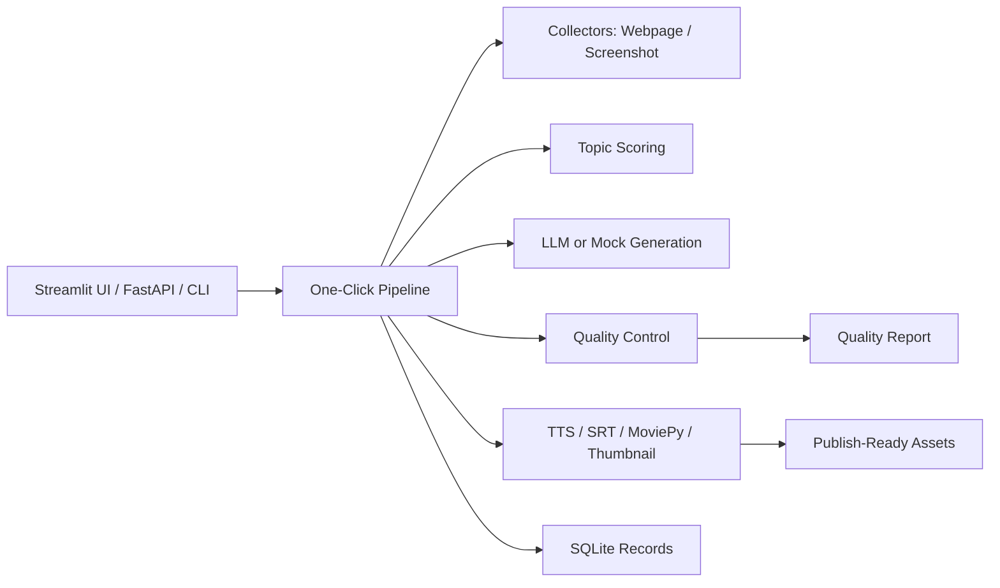
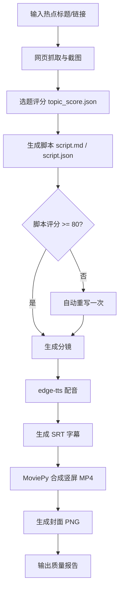

# Trend2Video Pro

**From Emerging Trend to Publish-Ready Short Video in One Click**

Trend2Video Pro 不是 AI 文案工具，也不是 Dashboard。它是一个“热点发现 + 内容决策 + 自动执行 + 质量控制”的短视频生产系统：输入热点标题或链接后，自动生成脚本、分镜、配音、字幕、封面、竖屏 MP4 和质量评分报告。

适合个人创作者、科技博主、AI 工具号、留学生自媒体。第一版不做自动发布，只在本地导出可发布的视频资产。

## 核心功能

- 网页信息抓取：使用 Playwright 截图，BeautifulSoup 抽取标题、描述和核心文本。
- 选题评分：用可解释公式输出热点分、竞争度、变现潜力、账号适配度、时效性和总分。
- 脚本生成：必须包含 3 秒强钩子、背景、3 个核心信息点、用户收益、结尾引导。
- 脚本质检：低于 80 分时自动重写一次。
- 分镜生成：每句旁白对应画面、素材类型、时长和字幕。
- 配音与字幕：edge-tts 生成语音，SRT 自动断句，每条不超过 18 个中文字。
- 视频合成：MoviePy 输出 1080x1920 竖屏 MP4，包含标题卡、场景卡、配音、字幕文本和结尾引导。
- 封面生成：输出科技风 PNG 封面。
- 最终报告：Markdown + JSON，包含评分、风险提示、优化建议和文件路径。

## 架构图



## Pipeline 流程图



## 安装方法

```bash
cd Trend2Video-Pro
python -m venv .venv
.venv\Scripts\activate
pip install -r requirements.txt
playwright install chromium
copy .env.example .env
```

如果暂时没有任何 LLM API Key，保持 `LLM_PROVIDER=mock` 即可本地演示。

## .env 配置

```env
OPENAI_API_KEY=
DEEPSEEK_API_KEY=
QWEN_API_KEY=
LLM_PROVIDER=mock
LLM_MODEL=mock-trend2video
DEFAULT_TTS_VOICE=zh-CN-XiaoxiaoNeural
OUTPUT_DIR=outputs
DATABASE_URL=sqlite:///data/trend2video.db
```

## 使用示例

启动执行型界面：

```bash
streamlit run app.py
```

命令行生成：

```bash
python main.py --title "OpenAI 发布新的 AI 视频工作流趋势" --platform B站 --duration 60 --style 科技资讯
```

启动 API：

```bash
uvicorn main:app --reload
```

调用 API：

```bash
curl -X POST http://127.0.0.1:8000/generate ^
  -H "Content-Type: application/json" ^
  -d "{\"title\":\"OpenAI 发布新的 AI 视频工作流趋势\",\"platform\":\"B站\",\"duration\":60,\"style\":\"科技资讯\"}"
```

## 输出示例

- `outputs/videos/trend_video.mp4`
- `outputs/scripts/script.md`
- `outputs/scripts/script.json`
- `outputs/subtitles/subtitles.srt`
- `outputs/thumbnails/thumbnail.png`
- `outputs/reports/topic_score.json`
- `outputs/reports/quality_report.md`
- `outputs/reports/quality_report.json`

## Quality Control

质量控制写在代码中，不只写在文档里：

- `src/scoring/trend_scorer.py`: `score_topic()` 使用公式 `0.3 * trend + 0.2 * audience_fit + 0.2 * monetization + 0.2 * urgency - 0.1 * competition`。
- `src/quality/script_reviewer.py`: `review_script()` 输出 hook、清晰度、信息密度、事实风险、平台适配和总分。
- `src/quality/video_quality_checker.py`: 检查 MP4 是否存在、文件大小和目标时长。
- `src/quality/final_report.py`: `generate_final_report()` 汇总风险和建议。选题低于 70 分会提示“不建议优先制作”。

## Roadmap

- 接入真实 GitHub Trending / Product Hunt 热点发现。
- 支持多模板视频风格和字幕高亮。
- 支持素材库、图片生成模型和 B-roll 自动匹配。
- 增加事实核查来源引用。
- 增加批量生成和队列任务。
- 增加账号画像与平台历史数据适配。

## Demo GIF

`docs/demo.gif` 占位：后续录制从输入热点到输出 MP4 的完整流程。

## License

MIT
