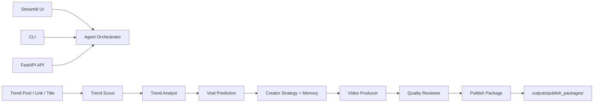

# Architecture

Trend2Video Pro is a Trend Intelligence + Content Execution System. It is not a dashboard: every interface routes the user toward a publishable local package.

## Agent Layer

- `trend_scout_agent`: normalizes topic candidates.
- `trend_analyst_agent`: scores opportunity and content angle.
- `creator_strategy_agent`: uses creator profile and memory to estimate fit.
- `script_writer_agent`: wraps the script generator.
- `fact_checker_agent`: produces source/risk checks for the script.
- `storyboard_agent`: wraps storyboard generation.
- `video_producer_agent`: executes the MoviePy/edge-tts media pipeline.
- `quality_reviewer_agent`: checks publish readiness.
- `orchestrator`: exposes `run_trend_to_video(...)`.

## Core Modules

- `src/collectors/`: GitHub Trending, Product Hunt, web screenshots, and topic updates.
- `src/scoring/`: explainable opportunity scoring.
- `src/creator/`: creator profile, creator memory, and fit scoring.
- `src/prediction/`: rule-based viral prediction MVP.
- `src/generation/`: LLM client, script, storyboard, title, and cover copy generation.
- `src/media/`: TTS, subtitles, video composition, thumbnails, and assets.
- `src/quality/`: script review, fact-risk hints, video checks, and final reports.
- `src/publishing/`: publish package export.
- `src/database/`: SQLite trends, creator memory, viral predictions, publish packages, and generation records.

## Design Principles

- Demo mode must work without API keys.
- Network failures should fall back to mock data.
- Quality control is part of the pipeline, not only README copy.
- The final artifact is a local MP4 plus title, description, hashtags, subtitles, thumbnail, metadata, and reports.
