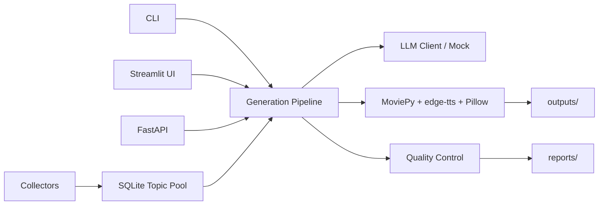

# Architecture

Trend2Video Pro is built around one pipeline: collect or receive a trend, score it, generate assets, and report quality.

## Main Modules

- `src/collectors/`: GitHub Trending, Hacker News, Product Hunt, and collector manager.
- `src/scoring/`: explainable opportunity scoring.
- `src/generation/`: LLM wrapper, script generation, storyboard generation, titles, and cover copy.
- `src/media/`: TTS, subtitles, video composition, thumbnails, and assets.
- `src/quality/`: script review, video checks, fact-risk hints, and final reports.
- `src/database/`: SQLite models and repository helpers.

## Design Principles

- The app should always be demoable without API keys.
- Network failures should degrade to mock data.
- Quality checks must run before the final report is produced.
- The final output is a local MP4 and production bundle, not only text.
